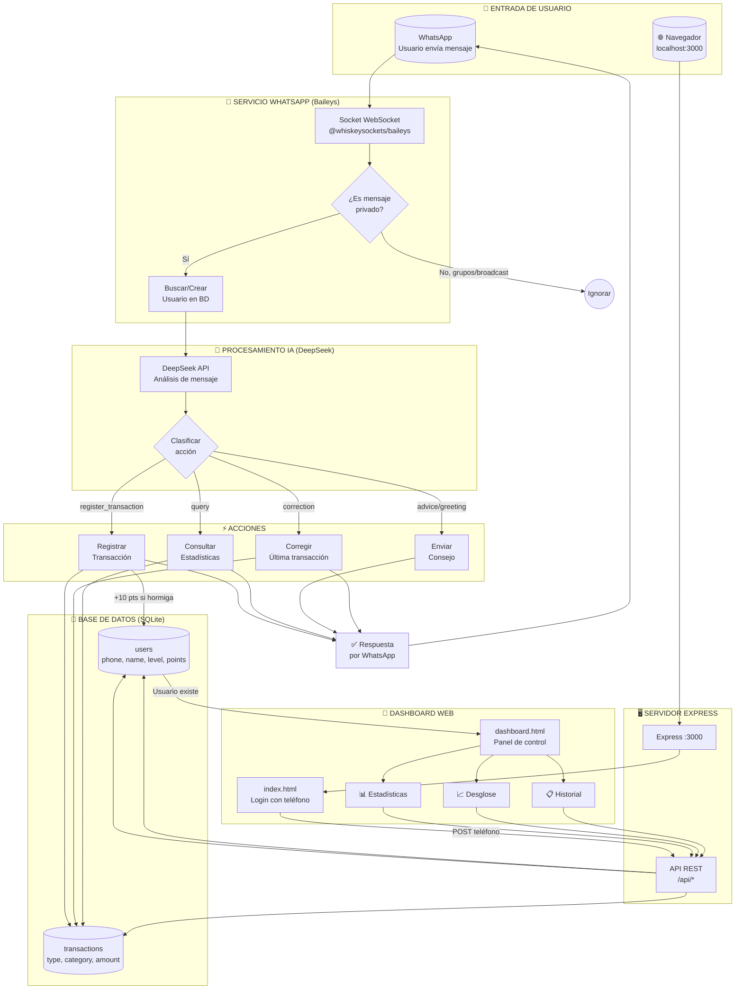

# 📋 Resumen de Funciones Principales - El Matador

## Índice
- [Transaction.js - Modelo de Transacciones](#1️⃣-transactionjs---modelo-de-transacciones)
- [User.js - Modelo de Usuarios](#2️⃣-userjs---modelo-de-usuarios)
- [deepseek.js - Servicio de IA](#3️⃣-deepseekjs---servicio-de-ia)
- [whatsapp.js - Servicio de WhatsApp](#4️⃣-whatsappjs---servicio-de-whatsapp-baileys)
- [Patrones Repetitivos](#-patrones-repetitivos-en-el-código)
- [Diagrama de Llamadas](#-diagrama-de-llamadas)
- [Diagrama de Flujo](#-diagrama-de-flujo-completo)

---

## 1️⃣ Transaction.js - Modelo de Transacciones

**Ubicación:** `src/models/Transaction.js`

| Función | Línea | Qué hace | Uso |
|---------|-------|----------|-----|
| `create(data)` | 5-29 | Inserta una nueva transacción en la BD | Se usa cada vez que el usuario registra un gasto/ingreso |
| `findById(id)` | 32-35 | Busca transacción por ID | Para obtener detalles de una transacción específica |
| `findByUserAndMonth(userId, month, year)` | 38-45 | Obtiene transacciones de un mes específico | Para el resumen mensual del dashboard |
| `findByUserLastDays(userId, days)` | 48-56 | Obtiene transacciones de los últimos N días | Para estadísticas semanales |
| `findByUser(userId, limit)` | 59-67 | Obtiene todas las transacciones de un usuario | Para historial en dashboard |
| `findByPhone(phoneNumber, limit)` | 70-78 | Busca transacciones por número de teléfono | Para API REST del dashboard |
| `updateLast(userId, updates)` | 81-124 | Corrige la última transacción del usuario | Cuando el usuario dice "corrección, eran $50" |
| `delete(id)` | 127-130 | Elimina una transacción | Para eliminar registros erróneos |
| `getMonthlyStats(userId, month, year)` | 133-145 | Suma totales por tipo (ingreso, gasto fijo, etc.) | Para las tarjetas del dashboard |
| `getCategoryBreakdown(userId, month, year)` | 148-162 | Desglose por categoría | Para ver qué categorías gastan más |
| `getWeeklyCategoryBreakdown(userId, days)` | 165-180 | Desglose por categoría de la semana | Para estadísticas semanales |
| `getTotalByType(userId, type, month, year)` | 183-192 | Obtiene total de un tipo específico | Para cálculos específicos |

### Ejemplo de uso - `create()`
```javascript
// Cuando el usuario dice "Compré un café de $25"
const transaction = Transaction.create({
    userId: 1,
    phoneNumber: '5512345678',
    type: 'ant_expense',
    category: 'Café o bebida diaria',
    amount: 25,
    description: 'Café',
    originalMessage: 'Compré un café de $25'
});
```

### Ejemplo de uso - `getMonthlyStats()`
```javascript
// Para el dashboard - obtener resumen del mes
const stats = Transaction.getMonthlyStats(userId, 11, 2025);
// Retorna: [
//   { type: 'income', total: 15000, count: 1 },
//   { type: 'ant_expense', total: 450, count: 12 },
//   { type: 'fixed_expense', total: 8000, count: 5 }
// ]
```

---

## 2️⃣ User.js - Modelo de Usuarios

**Ubicación:** `src/models/User.js`

| Función | Línea | Qué hace | Uso |
|---------|-------|----------|-----|
| `findOrCreate(phoneNumber, name)` | 5-18 | Busca usuario, si no existe lo crea | Primera vez que alguien escribe al bot |
| `findById(id)` | 21-24 | Busca usuario por ID | Para obtener datos actualizados |
| `findByPhone(phoneNumber)` | 27-30 | Busca usuario por teléfono | Validar login en dashboard |
| `updateLastInteraction(id)` | 33-41 | Actualiza timestamp de última interacción | Cada vez que el usuario envía mensaje |
| `addPoints(id, points)` | 44-61 | Suma puntos y actualiza nivel automáticamente | +10 pts por cada gasto hormiga registrado |
| `calculateLevel(points)` | 64-69 | Calcula nivel según puntos acumulados | Sistema de gamificación |
| `updateBudget(id, budget)` | 72-88 | Actualiza presupuesto mensual del usuario | Desde el dashboard web |
| `getLeaderboard(limit)` | 91-99 | Top usuarios por puntos | Ranking de usuarios |
| `updateName(id, name)` | 102-110 | Actualiza nombre del usuario | Si el usuario cambia su nombre en WhatsApp |

### Sistema de Gamificación - `calculateLevel()`
```javascript
// Niveles basados en puntos (línea 64-69)
static calculateLevel(points) {
    if (points >= 1000) return 'Maestro Cazador';   // 🏆 Dorado
    if (points >= 500) return 'Cazador Experto';    // 🟠 Naranja
    if (points >= 200) return 'Cazador Intermedio'; // 🔵 Azul
    return 'Cazador Novato';                        // 🟢 Verde
}
```

### Ejemplo de uso - `findOrCreate()`
```javascript
// Primera vez que un usuario escribe al bot
const user = User.findOrCreate('5512345678', 'Juan');
// Si existe: retorna el usuario existente
// Si no existe: crea nuevo usuario con nivel "Cazador Novato" y 0 puntos
```

### Ejemplo de uso - `addPoints()`
```javascript
// Después de registrar un gasto hormiga
const updatedUser = User.addPoints(userId, 10);
// Automáticamente recalcula el nivel si subió de categoría
```

---

## 3️⃣ deepseek.js - Servicio de IA

**Ubicación:** `src/services/deepseek.js`

| Función | Línea | Qué hace | Uso |
|---------|-------|----------|-----|
| `processMessage(userMessage, userContext)` | 70-123 | Envía mensaje a DeepSeek API y clasifica la intención | Cada mensaje de WhatsApp pasa por aquí |
| `generateWeeklySummary(transactions)` | 125-167 | Genera resumen motivacional semanal con IA | Para mensajes automáticos de resumen |

### Cómo funciona `processMessage()`

```
ENTRADA: "Compré un café de $25"
    │
    ▼
┌─────────────────────────────────────┐
│ 1. Construir contexto del usuario   │
│    - Gastos hormiga de la semana    │
│    - Total acumulado                │
└─────────────────────────────────────┘
    │
    ▼
┌─────────────────────────────────────┐
│ 2. Enviar a DeepSeek API            │
│    - SYSTEM_PROMPT (línea 11-68)    │
│    - Mensaje del usuario            │
│    - Contexto adicional             │
└─────────────────────────────────────┘
    │
    ▼
┌─────────────────────────────────────┐
│ 3. Parsear respuesta JSON           │
└─────────────────────────────────────┘
    │
    ▼
SALIDA: {
    action: "register_transaction",
    transaction: {
        type: "ant_expense",
        category: "Café o bebida diaria",
        amount: 25,
        description: "Café"
    },
    response: "¡Registrado! Otro cafecito eh...",
    advice: "Si reduces un café al día, ahorras $750 al mes"
}
```

### Acciones posibles de la IA
| Acción | Cuándo se usa | Siguiente paso |
|--------|---------------|----------------|
| `register_transaction` | Usuario reporta gasto/ingreso | Guardar en BD + responder |
| `correction` | Usuario corrige último registro | Actualizar BD + confirmar |
| `query` | Usuario pregunta estadísticas | Consultar BD + mostrar |
| `greeting` | Usuario saluda o charla | Solo responder |
| `advice` | Usuario pide consejo | Solo responder |
| `error` | No se entendió el mensaje | Pedir reformular |

### SYSTEM_PROMPT (línea 11-68)
```
Define:
- Personalidad: "El Matador", asistente financiero amigable
- Categorías válidas: 24 categorías en 4 tipos
- Formato de respuesta: JSON estructurado
- Reglas de clasificación de gastos
```

---

## 4️⃣ whatsapp.js - Servicio de WhatsApp (Baileys)

**Ubicación:** `src/services/whatsapp.js`

| Función | Línea | Qué hace | Uso |
|---------|-------|----------|-----|
| `initializeWhatsApp()` | 21-79 | Conecta con WhatsApp via Baileys, muestra QR | Se ejecuta al iniciar el servidor |
| `handleMessage(message)` | 81-185 | Procesa cada mensaje entrante | Función principal del bot |
| `handleRegisterTransaction()` | 187-226 | Guarda transacción y responde con confirmación | Cuando se detecta un gasto/ingreso |
| `handleCorrection()` | 228-246 | Corrige última transacción | Cuando el usuario dice "corrección" |
| `handleQuery()` | 248-325 | Responde consultas de estadísticas | "¿Cuánto gasté este mes?" |
| `sendMessage(phoneNumber, text)` | 327-334 | Envía mensaje por WhatsApp | Helper para enviar respuestas |
| `getClient()` | 336-338 | Retorna instancia del socket | Para uso externo si es necesario |

### Flujo de `initializeWhatsApp()` (línea 21-79)

```
1. Cargar credenciales guardadas (auth_info_baileys/)
2. Obtener última versión de Baileys
3. Crear socket de conexión
4. Configurar eventos:
   │
   ├── 'connection.update' (línea 35-62)
   │   ├── Si hay QR → mostrarlo en terminal
   │   ├── Si conexión cerrada → reconectar
   │   └── Si conexión abierta → log "Bot listo"
   │
   ├── 'creds.update' (línea 65)
   │   └── Guardar credenciales actualizadas
   │
   └── 'messages.upsert' (línea 68-76)
       └── Para cada mensaje nuevo → handleMessage()
```

### Flujo de `handleMessage()` (línea 81-185)

```
MENSAJE ENTRANTE
       │
       ▼
┌──────────────────────────────────────┐
│ 1. VALIDAR TIPO DE MENSAJE           │
│    (línea 87-106)                    │
│                                      │
│    ✓ @s.whatsapp.net = Privado → OK  │
│    ✗ @g.us = Grupo → Ignorar         │
│    ✗ @broadcast = Broadcast → Ignorar│
│    ✗ status@broadcast = Estado → Ign │
└──────────────────────────────────────┘
       │
       ▼
┌──────────────────────────────────────┐
│ 2. EXTRAER TEXTO                     │
│    (línea 109-117)                   │
│                                      │
│    message.conversation              │
│    || extendedTextMessage.text       │
│    Si está vacío → Ignorar           │
└──────────────────────────────────────┘
       │
       ▼
┌──────────────────────────────────────┐
│ 3. BUSCAR/CREAR USUARIO              │
│    (línea 122-142)                   │
│                                      │
│    User.findByPhone(phoneNumber)     │
│    Si no existe:                     │
│      - User.findOrCreate()           │
│      - Enviar mensaje de bienvenida  │
│      - return (no procesar más)      │
└──────────────────────────────────────┘
       │
       ▼
┌──────────────────────────────────────┐
│ 4. OBTENER CONTEXTO                  │
│    (línea 148-149)                   │
│                                      │
│    getWeeklyStats(user.id)           │
│    → antExpenseCount, antExpenseTotal│
└──────────────────────────────────────┘
       │
       ▼
┌──────────────────────────────────────┐
│ 5. PROCESAR CON IA                   │
│    (línea 152)                       │
│                                      │
│    processMessage(text, context)     │
│    → DeepSeek clasifica intención    │
└──────────────────────────────────────┘
       │
       ▼
┌──────────────────────────────────────┐
│ 6. EJECUTAR ACCIÓN                   │
│    (línea 155-178)                   │
│                                      │
│    switch(aiResponse.action)         │
└──────────────────────────────────────┘
       │
       ├── register_transaction
       │   └── handleRegisterTransaction()
       │
       ├── correction
       │   └── handleCorrection()
       │
       ├── query
       │   └── handleQuery()
       │
       ├── advice / greeting
       │   └── sendMessage(response)
       │
       └── default
           └── sendMessage("No entendí")
```

### Flujo de `handleRegisterTransaction()` (línea 187-226)

```javascript
// 1. Crear transacción en BD
const transaction = await createTransaction(userId, phoneNumber, {
    type: 'ant_expense',
    category: 'Café o bebida diaria',
    amount: 25,
    description: 'Café',
    originalMessage: 'Compré un café de $25'
});

// 2. Construir respuesta
let reply = `✅ *Registrado!*\n\n`;
reply += `💰 Monto: $${transaction.amount}\n`;
reply += `📁 Categoría: ${transaction.category}\n`;
reply += `📝 ${transaction.description}\n\n`;

// 3. Si es gasto hormiga, agregar info extra
if (transaction.type === 'ant_expense') {
    // Mostrar stats semanales
    // Mostrar consejo de IA
    // Mostrar puntos ganados (+10)
}

// 4. Enviar respuesta
await sendMessage(phoneNumber, reply);
```

### Flujo de `handleQuery()` (línea 248-325)

```
MENSAJE: "¿Cuánto gasté este mes?"
              │
              ▼
┌─────────────────────────────────┐
│ Detectar tipo de consulta       │
│ (línea 250-251)                 │
│                                 │
│ lowerMessage.includes('mes')   │
│ lowerMessage.includes('semana')│
│ lowerMessage.includes('hormiga')│
└─────────────────────────────────┘
              │
    ┌─────────┼─────────┐
    │         │         │
    ▼         ▼         ▼
  "mes"    "semana"  "hormiga"
    │         │         │
    ▼         ▼         ▼
┌────────┐ ┌────────┐ ┌────────────┐
│Monthly │ │Weekly  │ │Category    │
│Stats   │ │Stats   │ │Breakdown   │
│+ %     │ │+ prom  │ │solo hormiga│
│hormiga │ │diario  │ │            │
└────────┘ └────────┘ └────────────┘
    │         │         │
    └─────────┴─────────┘
              │
              ▼
      sendMessage(reply)
```

---

## 🔄 Patrones Repetitivos en el Código

### 1. Patrón de queries SQL (better-sqlite3)

```javascript
// PREPARAR → EJECUTAR → RETORNAR
const stmt = db.prepare('SELECT * FROM tabla WHERE campo = ?');
return stmt.get(valor);      // .get() = 1 resultado
return stmt.all(valor);      // .all() = múltiples resultados
return stmt.run(valor);      // .run() = INSERT/UPDATE/DELETE
```

**Se usa en:**
- `Transaction.js` - todas las funciones
- `User.js` - todas las funciones

---

### 2. Patrón de manejo de errores

```javascript
try {
    // código principal
} catch (error) {
    console.error('Error en X:', error);
    return { action: 'error', response: 'mensaje amigable' };
}
```

**Se usa en:**
- `deepseek.js:115-122`
- `whatsapp.js:180-184`
- `whatsapp.js:222-225`
- `whatsapp.js:242-245`
- `whatsapp.js:321-324`

---

### 3. Patrón de construcción de respuestas WhatsApp

```javascript
let reply = `✅ *Título en negrita*\n\n`;
reply += `💰 Campo: $${valor}\n`;
reply += `📁 Otro campo: ${valor}\n`;
reply += `📝 Descripción\n\n`;

if (condicion) {
    reply += `⚠️ Advertencia o info adicional`;
}

await sendMessage(phoneNumber, reply);
```

**Se usa en:**
- `whatsapp.js:198-220` - Confirmación de registro
- `whatsapp.js:233-238` - Confirmación de corrección
- `whatsapp.js:256-275` - Resumen mensual
- `whatsapp.js:280-291` - Resumen semanal
- `whatsapp.js:304-308` - Lista de gastos hormiga

---

### 4. Patrón de validación de tipo de mensaje

```javascript
// Solo procesar mensajes privados
if (!remoteJid.endsWith('@s.whatsapp.net')) {
    if (remoteJid.includes('@g.us')) {
        console.log('Ignorando grupo');
        return;
    }
    if (remoteJid.includes('@broadcast')) {
        console.log('Ignorando broadcast');
        return;
    }
    return;
}
```

**Se usa en:** `whatsapp.js:87-106`

---

### 5. Patrón de actualización dinámica (UPDATE con campos opcionales)

```javascript
const fields = [];
const values = [];

if (updates.amount !== undefined) {
    fields.push('amount = ?');
    values.push(updates.amount);
}
if (updates.category !== undefined) {
    fields.push('category = ?');
    values.push(updates.category);
}
// ... más campos opcionales

if (fields.length === 0) return; // Nada que actualizar

fields.push('updated_at = CURRENT_TIMESTAMP');
values.push(id);

const stmt = db.prepare(`
    UPDATE tabla
    SET ${fields.join(', ')}
    WHERE id = ?
`);
stmt.run(...values);
```

**Se usa en:** `Transaction.js:81-124` (función `updateLast`)

---

### 6. Patrón de extracción de texto de mensaje WhatsApp

```javascript
const messageText = message.message?.conversation ||
                   message.message?.extendedTextMessage?.text ||
                   '';

if (!messageText.trim()) {
    console.log('Ignorando mensaje vacío');
    return;
}
```

**Se usa en:** `whatsapp.js:109-117`

---

## 📊 Diagrama de Llamadas

```
Usuario WhatsApp
      │
      ▼
initializeWhatsApp() ──► sock.ev.on('messages.upsert')
      │
      ▼
handleMessage(message)
      │
      ├──► User.findByPhone() / User.findOrCreate()
      │
      ├──► getWeeklyStats() → Transaction.findByUserLastDays()
      │
      ├──► processMessage() → DeepSeek API
      │
      └──► switch(action)
            │
            ├── register_transaction
            │   └── createTransaction()
            │       ├── Transaction.create()
            │       └── User.addPoints() [si es hormiga]
            │
            ├── correction
            │   └── updateLastTransaction()
            │       └── Transaction.updateLast()
            │
            ├── query
            │   ├── getMonthlyStats()
            │   │   └── Transaction.getMonthlyStats()
            │   └── getCategoryBreakdown()
            │       └── Transaction.getCategoryBreakdown()
            │
            └── greeting/advice
                └── sendMessage()
```

---

## 🔀 Diagrama de Flujo Completo



---

## 📁 Estructura de Archivos Relevantes

```
src/
├── config/
│   ├── database.js      # Inicialización SQLite + creación de tablas
│   └── categories.js    # Definición de 24 categorías
│
├── models/
│   ├── User.js          # 10 métodos para gestión de usuarios
│   └── Transaction.js   # 12 métodos para gestión de transacciones
│
├── services/
│   ├── whatsapp.js      # 7 funciones para bot de WhatsApp
│   └── deepseek.js      # 2 funciones para procesamiento IA
│
├── controllers/
│   └── transactionController.js  # Lógica de negocio
│
├── routes/
│   └── api.js           # 8 endpoints REST
│
└── server.js            # Servidor Express
```
